<div align="center">

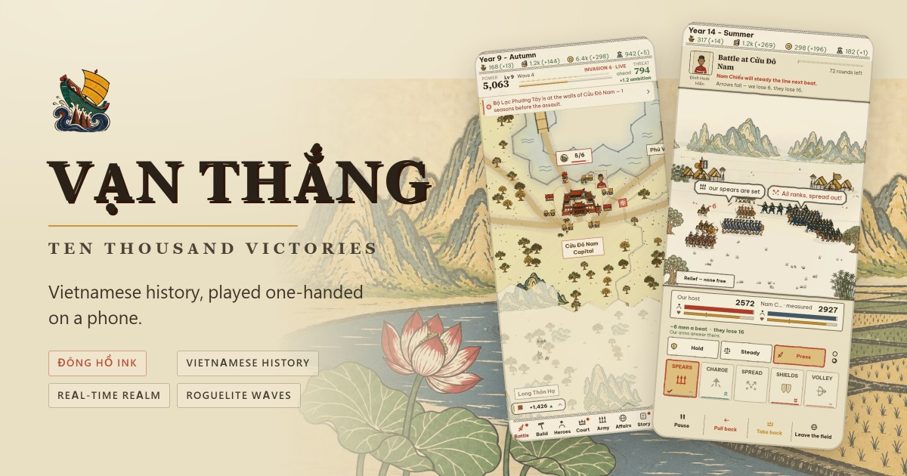

# Vạn Thắng

### *Ten Thousand Victories*

### Vietnamese history, played one-handed on a phone.

**A grand-strategy roguelite printed like a Đông Hồ woodblock — free, ad-free, in English and Tiếng Việt.**

**[🇻🇳 Đọc trang này bằng tiếng Việt](README.vi.md)**

<br>

<a href="https://zrg-team.github.io/ten-thousand-victories/"></a>

<sub>Install it from the browser — add to home screen, and it plays offline, full screen, with no store and no account.</sub>

<sub>Or support the developer — the same game on the stores, 50,000₫ (≈ US$2), once.</sub>

[](https://play.google.com/store/apps/details?id=zrg.team.vanthang)
&nbsp;
[](https://apps.apple.com/app/id6805950974)

<br>

[](https://github.com/zrg-team/ten-thousand-victories/actions/workflows/deploy-github-pages.yml)


[](LICENSE)

</div>

---

## 📑 Contents

- [🎯 Why this exists](#-why-this-exists)
- [🐉 How it plays — Dragon Ascent · Rồng Thăng Long](#-how-it-plays--dragon-ascent--rồng-thăng-long)
- [🌾 The economy — what the realm runs on](#-the-economy--what-the-realm-runs-on)
- [🎎 The heroes — a court worth paying](#-the-heroes--a-court-worth-paying)
- [🥁 The fight screen — five shapes and a drum](#-the-fight-screen--five-shapes-and-a-drum)
  - [The armies on the field](#the-armies-on-the-field)
- [📜 The Chronicle — the stories are the engine](#-the-chronicle--the-stories-are-the-engine)
- [🏮 The real history, one tap deep](#-the-real-history-one-tap-deep)
- [🖌️ A graphic perspective](#️-a-graphic-perspective)
  - [The cards — fifty prints, one behind every power](#the-cards--fifty-prints-one-behind-every-power)
  - [The heroes](#the-heroes)
  - [The armies of the kingdoms](#the-armies-of-the-kingdoms)
  - [Đông Hồ](#đông-hồ)
- [📱 Play](#-play)
- [🛠️ Develop](#️-develop)
- [🤝 Help improve the game](#-help-improve-the-game)
- [📄 License](#-license)
- [☕ Support](#-support)
- [🙏 Credits](#-credits)

## 🎯 Why this exists

Every Vietnamese child grows up with the same stories: the boy who played war with reed banners and became an emperor; the divine crossbow and the goose feathers that betrayed it; the stakes hidden in the Bạch Đằng river; the elders at Diên Hồng who answered *fight*; the boy who crushed an orange in his fist because he was too young to be let into the council.

Outside Việt Nam almost nobody knows them. Inside, they arrive as paragraphs in a textbook.

**Vạn Thắng** is an attempt to make that history *playable* — to have Yết Kiêu the diver, Lê Lai's borrowed coat and the Temple of Literature turn up as decisions on your screen, in a game good enough that people play it for the game. It is written for the phone in your pocket, in both languages as equals, and it is free.

## 🐉 How it plays — Dragon Ascent · *Rồng Thăng Long*

You are a small lord with one citadel on a map of forty-two provinces, generated fresh for every run. **The realm marches itself; you choose its power.** Time is real-time — the country ticks whether you are watching or not — and every choice arrives as a card you can answer with a thumb.

- **Waves.** Every year and a half an invading host arrives, bigger than the last; every fourth is a boss, telegraphed a season ahead. Survive as many as you can — there is no win, only how far you got.
- **Ambition is the dial.** Every province you take, every card you draft, every host you raise, raises the heat of what comes back at you. Expansion is never free.
- **Power draft.** Level up and choose one of four cards — bronze, silver, gold, jade — that stack permanently. Two cards you have maxed can *evolve* into something neither was. There are fifty-two, and [each carries its own woodblock print](#the-cards--fifty-prints-one-behind-every-power).
- **Doctrine.** Once an era, tell your ministers what kind of realm this is — *Fortify, Expand, Enrich, Arm* — and the autopilot builds towards it until you say otherwise.
- **The end of a run banks Legacy**, which buys permanent perks for the next.

<table>
  <tr>
    <td align="center" width="33%">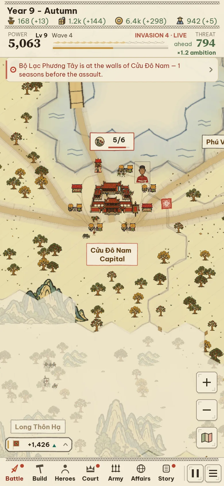<br><sub>The realm, mid-run</sub></td>
    <td align="center" width="33%">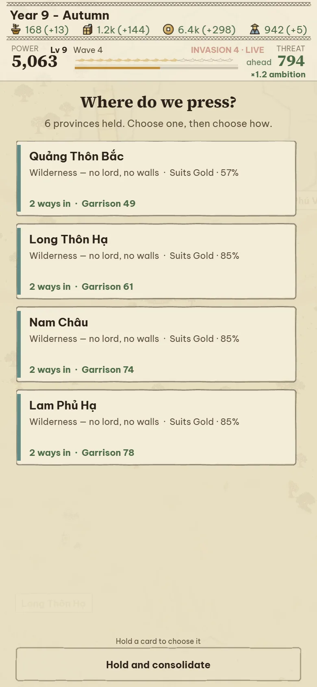<br><sub>Where do we press?</sub></td>
    <td align="center" width="33%">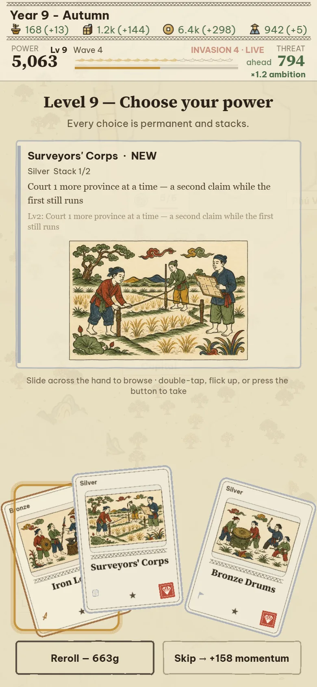<br><sub>Choose your power</sub></td>
  </tr>
</table>

Underneath that loop the game runs on four systems — an economy, a court of heroes, a battle screen, and a story engine — and the rest of this page is what they are and why.

## 🌾 The economy — what the realm runs on

<table>
  <tr>
    <td valign="top">

Four resources — **food, supplies, gold, humans** — flow from provinces whose yields come from their actual hexes: paddies and rivers feed, hills and mountains arm, ports trade. Seasons move the harvest (autumn ×1.25, winter ×0.8). Armies eat rations, burn provisions on the march, and desert when they starve; heroes draw wages; income past five hundred gold is taxed by diminishing returns, and a hoard past four thousand starts leaking to graft — the advisor will tell you exactly how much of your pile rots this season.

**Build is how you steer it.** Each province holds a few works; what you raise decides what the realm can do — walls buy defence, farms buy runway, markets buy the next summon. Work takes seasons, and the claims row at the top rations expansion itself: the realm can court only so many provinces at once, and *the court asks first* — a province within reach is put to you before a coin is spent on it.

**Why it is built this way.** A roguelite about expansion needs a brake that is not a timer, and the economy is it: every province taken and host raised feeds Ambition, which sizes the next wave — so the build screen is really a risk dial. And every number the interface quotes — the odds on a card, the rot on the hoard — is computed by the same code that will resolve it, so reading the screen *is* reading the simulation.

</td>
    <td width="38%">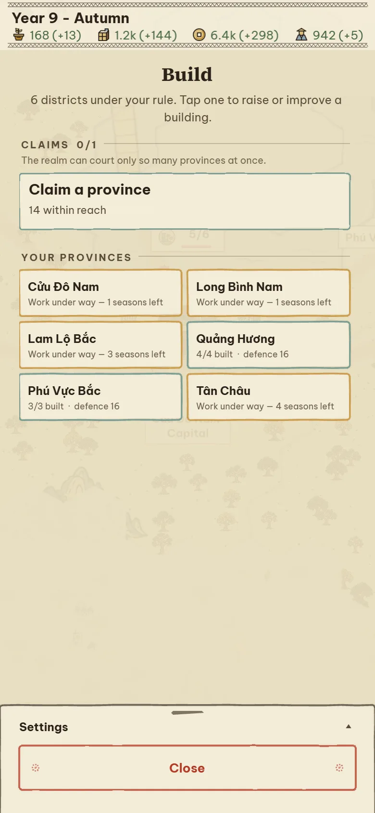</td>
  </tr>
</table>

## 🎎 The heroes — a court worth paying

<table>
  <tr>
    <td width="38%">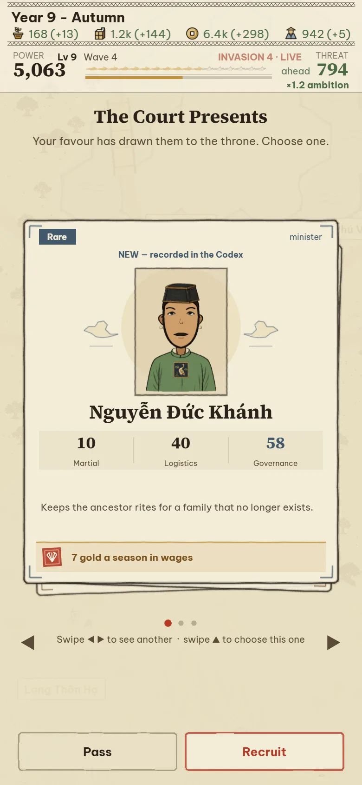</td>
    <td valign="top">

Champions arrive by **summon** — a gacha with pity, *three answer the call, one will serve* — or are drafted from your court's Favor. Each carries six stats (martial, logistics, administration, diplomacy, loyalty, renown), a wage the treasury feels every season, a character line worth reading, and a portrait; a first meeting is recorded in the Codex for good.

**How they move the game.** A hero is not a stat sheet in a menu: they govern provinces, carry missions, and above all *command* — the general on the battle plate moves the odds, and an unled host fights like one. They have lives of their own too: rivals start eating together, someone asks for a command, someone walks out — and the Chronicle casts its stories from exactly these people, so the general in your next legend is the one you summoned, paid, and nearly lost.

**Why it is built this way.** The history this game cares about is people, so the run needs a cast things can happen *to*. A gacha gives each run different company; wages tie the court to the economy; and the stats mean the question "who leads?" is a real decision, not flavour.

</td>
  </tr>
</table>

The portraits are not stock art. They are composed from a library of **277 drawn parts** — heads, hair, hats, collars, robes, marks — chosen by **who the person is** (era, office, rank, sex, vows) before a seed picks within that wardrobe, so an official of the Lê court does not wear a Nguyễn collar and a general in the field does not wear a scholar's cap. The roster runs to 127 champions, and many of them are real:

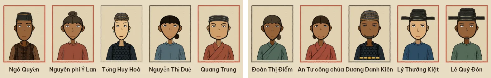

## 🥁 The fight screen — five shapes and a drum

<table>
  <tr>
    <td valign="top">

A fight worth watching opens itself: both hosts form up, the drum falls in five, and from then on you are reading the field. Every battle is fought with **five shapes** — *thế*, the postures an army takes: **Chông** the hedge of spears, **Xung** the wedge, **Tán** the loose swarm, **Quy** the tortoise, **Nỏ** the massed volley — and each beats the two that follow it, round the ring:

<div align="center">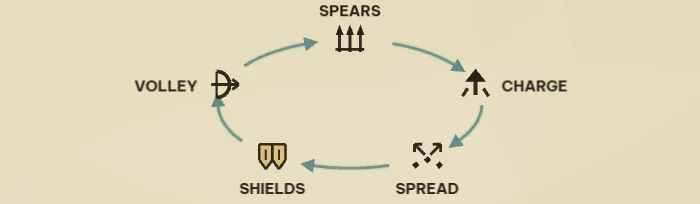</div>

The enemy telegraphs what they hold and what they are re-forming into, in words over their line — *their spears are set*, *they form Quy · 3* — and you answer. On top of the shapes sits a **tempo dial** from *pull back* to *press*, which decides how fast men are spent and multiplies your read — leaning on the right shape wins bigger, leaning on the wrong one bleeds worse. **Dồn sức** wagers a second pip on the shape you already hold; the **reserve** is committed once; relief can be sent for; or hand the whole thing to your generals — their judgement is worth something, never as much as being there.

**Why it is built this way.** No unit micromanagement survives a phone held in one hand. The fight is instead one legible question — *what are they holding, and what answers it?* — asked under a clock, with everything readable at arm's length. And it is never separate from the run: the hosts are the ones your economy raised, the commander is the hero you paid, and the outcome moves the ground held, the momentum, and the heat of the next wave.

</td>
    <td width="38%">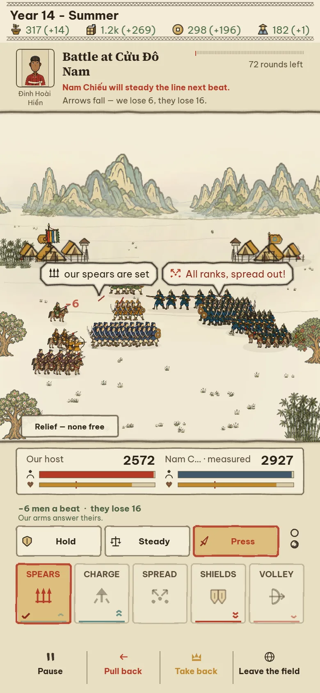</td>
  </tr>
</table>

### The armies on the field

Nothing on the field is a sprite sheet. A host is drawn as ranked figures standing in the shape it is actually holding — spears two deep, horse gathered at the point, shields locked — under its own banner, with its camp behind it, from the same procedural ink that draws the paddies and the citadels. What you can read at a glance — *their line is still forming, ours is a set hedge* — **is** the state of the fight:

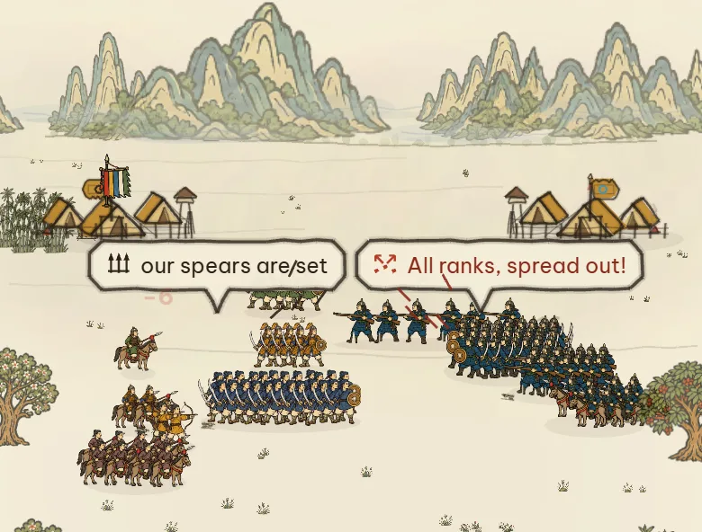

## 📜 The Chronicle — the stories are the engine

The stories are not cutscenes. They are **forty-nine templates** that bind themselves to *your* heroes and *your* provinces when the moment fits — a whisper on the map between decisions, a card in your hand, or a blow that changes the run — and each one is a piece of Vietnamese history or legend, told at the length a run has room for.

<table>
  <tr>
    <td width="40%">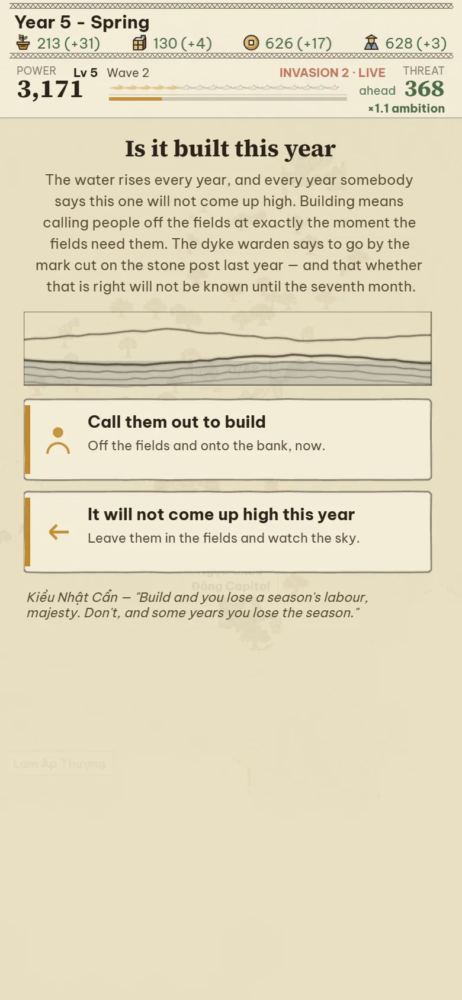</td>
    <td valign="top">

**A few of the pages**

- *Ngọn Cờ Lau* · The Reed Banner — Đinh Bộ Lĩnh
- *Nỏ Thần* · The Divine Crossbow — and *Lông Ngỗng*, the goose feathers
- *Cọc Bạch Đằng* · The Stakes in the River
- *Hội Nghị Diên Hồng* · The Elders Answer
- *Quả Cam* · The Orange — Trần Quốc Toản
- *Nam Quốc Sơn Hà* · The Mountains and Rivers of the Southern Land
- *Bình Ngô Đại Cáo* · The Great Proclamation
- *Hai Bà Trưng* · The Trưng Sisters, and *Sáu Mươi Lăm Thành*
- *Lê Lai Đổi Áo* · The Substitution
- *Hồ Gươm* · The Lake of the Returned Sword
- *Yết Kiêu* · The Diver · *Ải Chi Lăng* · *Thần Tốc* · *Văn Miếu* · *Thánh Gióng* · *Sơn Tinh Thủy Tinh* …

**How they move the game.** A story is played with real pieces: it casts the general you actually summoned and the province you actually hold, its choices spend real gold and real men, and when it resolves, the card says exactly what it changed — *−400 able men, −60 gold, the story turns toward a command*. Some ask you to **swear a charge** — hold a province, keep the peace — and remember whether you kept it. Some leave **echoes** in the browser, so a hero who walked out on you in one run can be named in the next. Sixteen of the beats arrive under [a print of their own](#the-cards--fifty-prints-one-behind-every-power) — the moment the story turns on, cut as a woodblock.

**Why it is built this way.** The stories are the point of the whole project — but a story you can skip is a cutscene, and a cutscene teaches nothing. Binding them to the run's own heroes, land and treasury makes the history something that *happens to you*. Every telling is tagged for what it is — *chính sử*, what the annals record; *dã sử*, what is told; *ngoại truyện*, what is only ours — and all of it lands in a Chronicle you can read back at the end.

</td>
  </tr>
</table>

## 🏮 The real history, one tap deep

<table>
  <tr>
    <td valign="top">

The game dramatises; this page does not. **History**, one tap from the front page, states its own terms: *what actually happened, and what this game made of it*. Five tabs in both languages — the dynasties in order, the people with their portraits and dates, every story the Chronicle tells set against the record, how the armies of each era fought, and the terms a newcomer meets — a reference a curious player can fall into for an hour.

The game also teaches itself: a **How to Play** page, guided tours of the first run, and an advisor strip that reads *your* live run and says what it would do next — so the strategy genre's usual wall of numbers is somebody's actual advice instead.

</td>
    <td width="38%">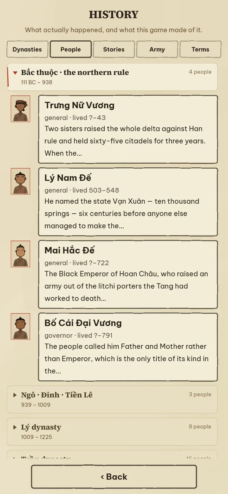</td>
  </tr>
</table>

## 🖌️ A graphic perspective

Everything above is one picture drawn by two hands, both working in the manner of a **Đông Hồ folk woodblock print**. **Plates** are drawn ahead of time to a written rule sheet — one warm-black contour, flat pigment blocks, shallow symbolic space, shell-coated paper. **Ink** is drawn by code at run time to the same rules, because a country generated fresh for every run cannot be painted in advance. The seam between them is meant to be invisible.

| Drawn ahead, as plates | Drawn by code, at run time |
|---|---|
| **50** card prints — one behind every power card, plus 12 settings | the **country** itself: hexes, paddies, rivers, roads, fog, laid out fresh every run |
| **325** map plates — soldiers by realm and rank, roofs, trees, carts, buffalo | **4 seasons** on that same ground — the leaves turn, the paddies flood and are cut |
| **277** portrait parts — heads, hair, hats, collars, robes, rank marks | **5 shapes** a host can stand in, drawn as it is actually holding them |

### The cards — fifty prints, one behind every power

A power card is not an icon and a number. Each of the fifty carries its own scene, cut to the same rule sheet — the stakes going into the Bạch Đằng, the Trưng sisters and their elephant, the pass at Chi Lăng, the armourer's crossbow, the boys admitted at the Temple of Literature, the grain fleet at Vân Đồn:

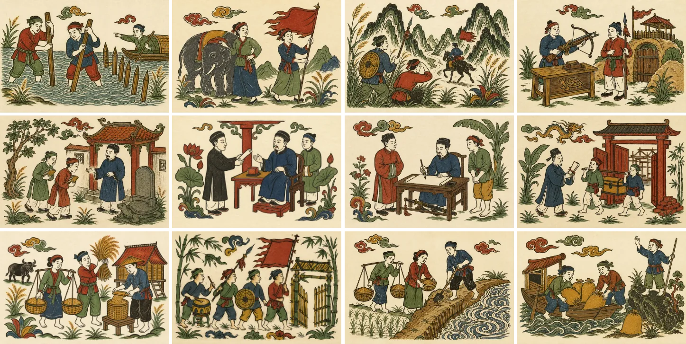

<table>
  <tr>
    <td valign="top">

They are not decoration on a menu. The same print turns up wherever that idea does: on the card you draft mid-run, on the Chronicle beat that tells its story, in the sheet a minister hands you — and all of them together in the **Dynasty Deck**, the one collection that outlives a run. Every reign ending and every tenth wave pays a draw; a draw is a card kept for good. Three copies fold into a stronger one, and up to three ride into the next reign's opening hand — bought with ambition, so the enemy answers your head start.

**Why it is built this way.** A roguelite's power cards are usually a wall of icons, and a wall of icons is a wall of nothing to remember. Here every card is a picture of the thing it does, from a tradition the game is about — so a player who cannot yet read *Nỏ Thần* still knows which card is the crossbow, and a collection screen is worth opening for its own sake.

</td>
    <td width="38%">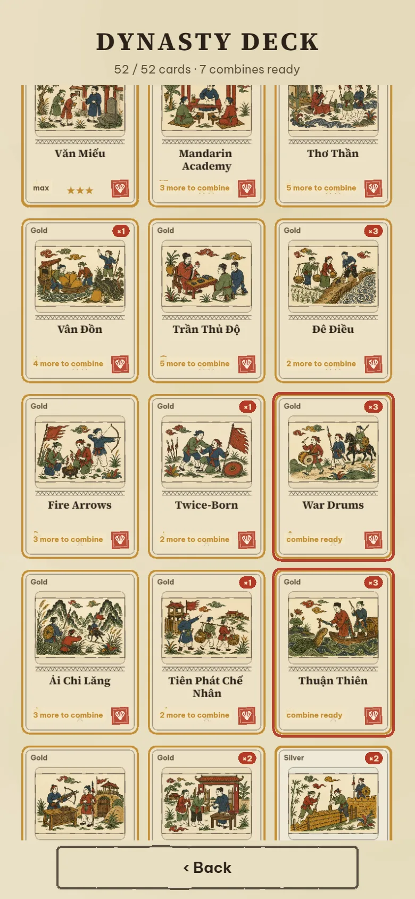</td>
  </tr>
</table>

### The heroes

Ten champions who exist in no roster: the generator invents the person — name, era, office — and the wardrobe dresses them by who they are, from the same **277 drawn parts** that dress the real figures above. No two courts look alike:

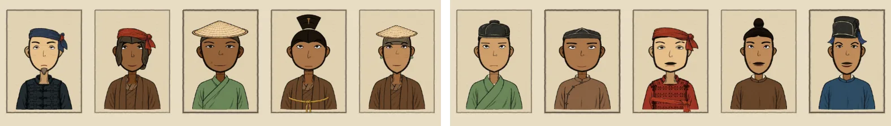

### The armies of the kingdoms

Every realm's host is built from one figure vocabulary — the ranks, the standard riding with them, the camp behind — and stands in the shape it is actually holding. The men stay in ink on purpose: painting a rival's ranks in its banner hue made every garrison the loudest thing on the map, so ownership is carried by the standard, never by the soldiers. Five realms of one run, five shapes:

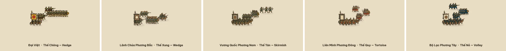

### Đông Hồ

The print itself: shell-coated điệp paper, a colour block pulled first and a soot-black contour pulled second, never quite in register, in a palette of real pigments — điệp, mực, sỏi son, chàm, gỉ đồng, hoè, nâu — with the saturated red spent on the player alone. Nothing seasonal is a colour filter over the screen; the leaves change, the paddies flood, ripen and are cut, the winter is bare. The same square of country, four times a year:

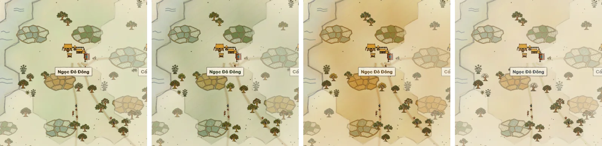

## 📱 Play

**[▶ zrg-team.github.io/ten-thousand-victories](https://zrg-team.github.io/ten-thousand-victories/)** — no install, no account, nothing leaves your device.

- Built for a **portrait phone in one hand**. On a **computer** — anything with a mouse, or the Steam build — the game plays by desktop rules: keys for the bar (`1`–`7`), `Space` to pause, `Esc` to close, the wheel to zoom, `WASD` to pan, and new runs start on the hands-on rule (the mandate card and the run menu turn it off). In a landscape window the map takes the whole window with the controls in a column at its right edge; a portrait window keeps the phone column. **Settings → Layout** shows which is on and can pin either.
- **Installs** from the browser menu and **plays offline** — a hand-rolled service worker, no store between you and the game.
- **Drag** to pan, **+ / −** to zoom, **tap** a province, **tap** a card to answer it.
- **English / Tiếng Việt** in Settings, along with graphics quality and the map theme.
- One save slot, kept in your browser.

**Or get it from a store.** The same game, packaged as a real app — [**Google Play**](https://play.google.com/store/apps/details?id=zrg.team.vanthang) and the [**App Store**](https://apps.apple.com/app/id6805950974), about 50,000₫ (≈ US$2), paid once. Still no ads, no in-app purchases, no account, and it plays with the network off. Nothing there is missing from the browser version — buying it is how you back the work. A **Steam** build (Windows, macOS, Linux, Steam Deck) is packaged from the same code in [`apps/desktop`](apps/desktop/) and is on its way to the store.

## 🛠️ Develop

```bash
corepack enable          # provides the pinned Yarn
yarn install
yarn dev                 # http://localhost:5179
yarn build               # tsc && vite build + the service worker — the CI gate
```

Vite + TypeScript (strict) + Phaser 4, no backend, no framework beyond that. Content is data: units, heroes, cards, edicts, provinces and every story live under `src/data/`, systems are plain functions over one `GameState`, and every player-facing string has an English and a Vietnamese entry — the game refuses to boot if one is missing.

There is no test framework. The game is proven by **driving it in a real headless browser**: `test_scripts/` holds over 180 Playwright harnesses — filed by the question they answer: `verify/` asserts, `shot/` photographs, `perf/` measures, `playtest/` judges, `diag/` investigates — that boot every mode, tick the economy for hundreds of seasons across many seeds, tap the real buttons, screenshot every screen, and score how *fun* a build is out of 100 before and after a balance change.

```bash
node test_scripts/gate/smoke.mjs              # every mode boots, ticks, draws — ~40 s
node test_scripts/verify/verify-ascent.mjs      # the Dragon Ascent loop end to end
node test_scripts/playtest/playtest-metrics.mjs   # six measured preconditions of fun, /85
node test_scripts/shot/shot-readme.mjs        # regenerates every picture on this page
```

The repository also carries a set of [Claude Code](https://claude.com/claude-code) skills and slash-commands (`.claude/`) that teach an AI assistant the art system, the hex map, the gameplay rules and the harness conventions, so contributions with an assistant start from the same understanding as contributions without one.

```
src/
├── data/        content — heroes, cards, edicts, provinces, 49 stories
├── systems/     rules — the tick, economy, combat, ascent/, empire/, story/
├── state/       GameState, save, legacy, codex
├── map/         hex maths, generation, terrain, boundaries, roads
├── ui/          renderers and panels; ui/ink/ is the Đông Hồ drawing vocabulary
├── scenes/      Boot → Preload → Menu · Guide · History → Conquest+ConquestUI · BattleArena
│   └── deprecated/  the retired classic screens — they still boot, nobody works on them
└── i18n/        catalogs — en and vi, side by side
apps/            platform shells; the game is built once and served by each
├── mobile/      Expo — iOS and Android
└── desktop/     Electron — Windows, macOS, Linux, for Steam
docs/            design documents and generated reference pages
test_scripts/    the Playwright harnesses
├── verify/      pass/fail gates
├── shot/        screenshot drivers
├── perf/        render, bake and heap cost
├── playtest/    is it fun — metrics, sessions, full playthroughs
├── diag/        one-off investigations
└── gate/        smoke and console checks
```

## 🤝 Help improve the game

Issues and pull requests are open. The most useful things you can bring, in order:

1. **Play it and say what was confusing.** A screenshot and a sentence is enough.
2. **History.** A story that is told wrong, a name that is spelt wrong, a detail a Vietnamese reader would wince at — please open an issue. The stories are dramatised, but they should never be *false*.
3. **Vietnamese copy.** Both languages are meant to be equals; where the Vietnamese reads like a translation, it should be rewritten, not patched.
4. **A new story.** `src/data/stories/countingHouse.ts` is the smallest complete template; the effect vocabulary in `src/systems/story/effects.ts` is what a story is allowed to do to the world.

Before opening a pull request: `yarn build` must pass, and `node test_scripts/gate/smoke.mjs` should be green against your dev server.

One thing to know before you send one: the official builds are sold in the app stores, and this licence alone would not let them carry your work — so opening a pull request licenses your contribution under the same terms **and** grants the maintainer the right to ship it commercially as part of the official game. You keep the copyright in what you wrote. If you would rather not grant that, say so in the pull request — an issue describing the change is still genuinely useful.

## 📄 License

**[PolyForm Noncommercial 1.0.0](LICENSE)** — do anything you like with this, except make money from it. Commercial use needs permission first; [just ask](https://github.com/zrg-team).

Phaser, Vite, TypeScript, Playwright and the fonts keep their own licences — see [LICENSE](LICENSE).

## ☕ Support

The game is free and stays free — that part is not going to change. If it gave you an evening, there are three ways to say so.

**The best one: buy the app.** [Google Play](https://play.google.com/store/apps/details?id=zrg.team.vanthang) · [App Store](https://apps.apple.com/app/id6805950974) — about 50,000₫ (≈ US$2), once. You get the same game with a home-screen icon and offline play, and it is the only channel that also carries the game to people who would never find a GitHub link.

**Or send it directly** — scan with your phone, or tap the link.

<table>
  <tr>
    <td align="center" width="50%">
      <br><br>
      <a href="https://wise.com/pay/me/tand99"><b>Wise · international</b></a><br>
      <sub>wise.com/pay/me/tand99 · @tand99</sub>
    </td>
    <td align="center" width="50%">
      <br><br>
      <a href="https://me.momo.vn/6OfbtWIOTeIJi5Tw"><b>MoMo · Việt Nam</b></a><br>
      <sub>me.momo.vn · any bank app can scan it</sub>
    </td>
  </tr>
</table>

Or star the repository — it is how the next person finds the game.

## 🙏 Credits

- The Đông Hồ printmakers of Bắc Ninh, whose pigments and register this game is trying to be worthy of.
- Fonts: [Be Vietnam Pro](https://fonts.google.com/specimen/Be+Vietnam+Pro) and [Source Serif 4](https://fonts.google.com/specimen/Source+Serif+4), SIL Open Font License, self-hosted so the diacritics render the same on every device.
- Built on [Phaser 4](https://phaser.io), [Vite](https://vite.dev) and [Playwright](https://playwright.dev).
- The history belongs to everyone; the mistakes in telling it are the author's.

<div align="center">
<sub><i>Nam quốc sơn hà Nam đế cư.</i></sub>
</div>
