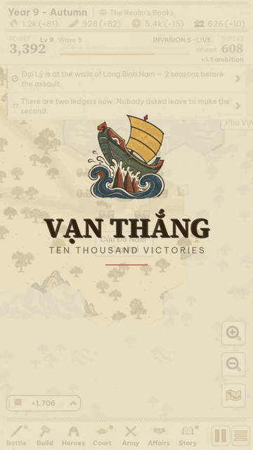

<div align="center">


# Vạn Thắng

### *Ten Thousand Victories*

### Lịch sử Việt Nam, cầm điện thoại một tay là chơi được.

**Game chiến lược roguelite, vẽ theo lối tranh khắc gỗ Đông Hồ. Miễn phí, không quảng cáo, đủ cả tiếng Việt lẫn tiếng Anh.**

**[🇬🇧 Read this page in English](README.md)**

<br>

<a href="https://zrg-team.github.io/ten-thousand-victories/"></a>

<sub>Cài từ trình duyệt — thêm vào màn hình chính là chơi được ngoại tuyến, toàn màn hình, không cần cửa hàng hay tài khoản.</sub>

<sub>Hoặc ủng hộ tác giả — vẫn game ấy, trên hai chợ app, 50.000₫ (≈ 2$), trả một lần.</sub>

[](https://play.google.com/store/apps/details?id=zrg.team.vanthang)
&nbsp;
[](https://apps.apple.com/app/id6805950974)

<br>



<sub>Hai mươi bảy giây trích từ một ván chơi thật. Không dàn dựng — từng khung hình đều là game đang chạy.</sub>

<br>

[](https://github.com/zrg-team/ten-thousand-victories/actions/workflows/deploy-github-pages.yml)


[](LICENSE)

</div>

---

## 📑 Mục lục

- [🎯 Vì sao có game này](#-vì-sao-có-game-này)
- [🐉 Chơi thế nào — Rồng Thăng Long · Dragon Ascent](#-chơi-thế-nào--rồng-thăng-long--dragon-ascent)
- [🌾 Kinh tế — giang sơn sống bằng gì](#-kinh-tế--giang-sơn-sống-bằng-gì)
- [🎎 Danh tướng — một triều đình đáng đồng lương](#-danh-tướng--một-triều-đình-đáng-đồng-lương)
- [🥁 Trận mạc — năm thế và một hồi trống](#-trận-mạc--năm-thế-và-một-hồi-trống)
  - [Những đạo quân trên chiến trường](#những-đạo-quân-trên-chiến-trường)
- [📜 Sử Ký — chuyện kể chính là cỗ máy](#-sử-ký--chuyện-kể-chính-là-cỗ-máy)
- [🏮 Lịch sử thật, chạm một cái là tới](#-lịch-sử-thật-chạm-một-cái-là-tới)
- [🖌️ Chuyện vẽ vời](#️-chuyện-vẽ-vời)
  - [Những lá bài — năm mươi bức tranh, mỗi lá một bức](#những-lá-bài--năm-mươi-bức-tranh-mỗi-lá-một-bức)
  - [Danh tướng](#danh-tướng)
  - [Quân đội các vương quốc](#quân-đội-các-vương-quốc)
  - [Đông Hồ](#đông-hồ)
- [📱 Chơi](#-chơi)
- [🛠️ Phát triển](#️-phát-triển)
- [🤝 Cùng làm game hay hơn](#-cùng-làm-game-hay-hơn)
- [📄 Giấy phép](#-giấy-phép)
- [☕ Ủng hộ](#-ủng-hộ)
- [🙏 Tri ân](#-tri-ân)

## 🎯 Vì sao có game này

Mình lớn lên với mấy câu chuyện ấy, chắc bạn cũng vậy: cậu bé chăn trâu bẻ cờ lau tập trận, về sau lên ngôi hoàng đế; chiếc nỏ thần và vệt lông ngỗng dẫn giặc theo sau; bãi cọc nằm im dưới lòng sông Bạch Đằng; điện Diên Hồng vang một tiếng *Đánh!*; và cậu thiếu niên đứng ngoài cửa hội nghị, bóp nát quả cam trong tay lúc nào không hay.

Ra nước ngoài mà kể, gần như không ai biết. Còn ở nhà, chúng nằm im trong sách giáo khoa — học để thi, thi xong thì thôi.

**Vạn Thắng** là cách mình trả lời một câu hỏi cứ lởn vởn mãi: nếu kho sử ấy *chơi được* thì sao? Nếu Yết Kiêu, tấm áo bào của Lê Lai hay Văn Miếu không phải bài học thuộc lòng, mà là những quyết định hiện ra ngay trên màn hình — trong một game đủ hay để bạn chơi vì nó hay, chứ không phải vì nó "bổ ích"? Game làm cho chiếc điện thoại trong túi bạn, hai thứ tiếng ngang hàng nhau, và không tốn của bạn đồng nào.

## 🐉 Chơi thế nào — Rồng Thăng Long · *Dragon Ascent*

Bạn là một tiểu vương với vỏn vẹn một tòa kinh thành, giữa bản đồ bốn mươi hai trấn — ván nào cũng sinh bản đồ mới. **Giang sơn tự vận hành. Ngươi chọn sức mạnh cho nó.** Thời gian trôi thật: bạn rời mắt thì đất nước vẫn chạy. Còn mọi lựa chọn đều hiện lên thành lá bài, ngón cái chạm một cái là xong.

- **Giặc đến theo đợt.** Chừng năm rưỡi một đợt, đợt sau đông hơn đợt trước; cứ đợt thứ tư là một trận trùm, báo trước hẳn một mùa. Không có màn "thắng" — chỉ có bạn trụ được tới đâu.
- **Tham vọng có giá của nó.** Chiếm thêm trấn, rút thêm bài, mộ thêm quân — làm gì cũng khiến đợt giặc sau hung hơn. Muốn mở cõi thì phải chịu nóng.
- **Lên cấp, chọn sức mạnh.** Bốn lá — đồng, bạc, vàng, ngọc — chọn một, cộng dồn vĩnh viễn. Hai lá đã nâng kịch trần còn *tiến hóa* được thành một lá mới toanh. Cả thảy năm mươi hai lá, và [lá nào cũng mang một bức tranh khắc riêng](#những-lá-bài--năm-mươi-bức-tranh-mỗi-lá-một-bức).
- **Định đường lối.** Mỗi thời đại một lần, bạn nói với quần thần: giang sơn này *Cố Thủ*, *Mở Mang*, *Làm Giàu* hay *Dựng Binh*. Nói xong, bộ máy cứ thế mà xây — tới khi bạn đổi ý.
- **Thua cũng không về tay trắng.** Hết ván, mọi thứ quy ra **Di sản** — mua đặc quyền vĩnh viễn cho ván sau.

<table>
  <tr>
    <td align="center" width="33%"><br><sub>Giang sơn, giữa một ván chơi</sub></td>
    <td align="center" width="33%"><br><sub>Ta đánh vào đâu?</sub></td>
    <td align="center" width="33%"><br><sub>Chọn sức mạnh</sub></td>
  </tr>
</table>

Đỡ bên dưới vòng lặp ấy là bốn hệ thống: kinh tế, triều đình, trận mạc, và chuyện kể. Phần còn lại của trang này kể về từng thứ — và lý do mình làm nó như thế.

## 🌾 Kinh tế — giang sơn sống bằng gì

<table>
  <tr>
    <td valign="top">

Giang sơn sống nhờ bốn thứ: **lương thực, vật tư, vàng, nhân khẩu**. Chúng chảy ra từ các trấn, mà trấn thì ăn theo đúng mảnh đất của nó — ruộng nước, sông ngòi nuôi người; đồi núi rèn giáp; cửa cảng buôn bán. Mùa nào thức nấy: vụ thu bội thu (×1,25), mùa đông đói kém (×0,8). Quân thì ăn lương, hành quân thì đốt vật tư, để đói là trốn sạch. Tướng lĩnh nhận bổng lộc đều đặn từng mùa. Mà giàu quá cũng khổ: thu vàng vượt năm trăm là thuế lũy thoái bắt đầu gặm, kho chất quá bốn nghìn là của cải âm thầm bốc hơi vì tham nhũng — quân sư sẽ nói thẳng cho bạn biết mùa này kho mục mất bao nhiêu.

**Muốn lái giang sơn thì cầm lấy việc xây.** Mỗi trấn dựng được vài công trình, và dựng gì thì được nấy: thành để giữ, ruộng để sống, chợ để có tiền triệu hồi tướng. Xây thì lâu, vài mùa một công trình. Còn muốn lấn đất, cứ nhìn hàng "yêu sách" trên đầu màn hình: triều đình mỗi lúc chỉ ve vãn được chừng ấy trấn, và *họ sẽ hỏi bạn trước* — trấn nào vừa tầm sẽ được trình lên để bạn gật hay lắc, xong xuôi mới tiêu tiền.

Sao phải lằng nhằng vậy? Vì một roguelite về mở cõi cần cái phanh, mà phanh tử tế thì không thể là đồng hồ đếm ngược. Ở đây kinh tế chính là phanh: mỗi trấn chiếm, mỗi đạo quân mộ đều đổ thêm vào Tham vọng, mà Tham vọng thì quyết định đợt giặc sau to cỡ nào — nên màn hình xây, nói trắng ra, là cái núm chỉnh độ liều. Còn mọi con số trên giao diện — tỉ lệ thắng trên lá bài, phần kho sắp mục — đều do chính đoạn code sẽ phân xử chuyện đó tính ra. Đọc màn hình là đọc thẳng vào ruột game, không phải đọc lời quảng cáo của nó.

</td>
    <td width="38%"></td>
  </tr>
</table>

## 🎎 Danh tướng — một triều đình đáng đồng lương

<table>
  <tr>
    <td width="38%"></td>
    <td valign="top">

Tướng về với bạn qua **triệu hồi** — gacha có bảo hiểm hẳn hoi, *ba người ứng mệnh, một người sẽ phò tá* — hoặc do triều đình tiến cử khi Ân sủng đủ dày. Mỗi người một bộ sáu chỉ số (võ lược, hậu cần, nội trị, bang giao, trung thành, danh vọng), một khoản bổng lộc mà quốc khố thấm đòn từng mùa, một câu cửa miệng đáng đọc chậm, và một bức chân dung. Ai gặp lần đầu là được ghi tên vào Codex, vĩnh viễn.

**Trong game họ làm gì?** Đủ thứ, trừ việc nằm im trong menu. Họ trấn thủ, đi sứ, và trên hết là *cầm quân*: trận có chủ tướng với trận vô chủ là hai câu chuyện khác hẳn nhau. Họ còn có đời sống riêng: hai kẻ vốn ghét nhau bỗng ngồi chung mâm, người này xin binh quyền, kẻ kia dứt áo ra đi. Và các câu chuyện trong Sử Ký lấy diễn viên từ chính đám người này — nhân vật chính trong truyền kỳ sắp tới của bạn là vị tướng bạn đã triệu về, nuôi cơm, và suýt nữa để mất.

Sao phải cầu kỳ vậy? Vì thứ lịch sử game này quý nhất là con người, nên mỗi ván cần một dàn nhân vật để chuyện còn có chỗ mà xảy ra. Gacha cho mỗi ván một đám bạn đồng hành khác nhau; bổng lộc trói triều đình vào túi tiền; còn chỉ số khiến câu "ai cầm quân trận này?" thành chuyện phải cân nhắc thật, không phải để trang trí.

</td>
  </tr>
</table>

Chân dung không phải ảnh mua sẵn. Mỗi khuôn mặt ghép từ **277 mảnh vẽ tay** — đầu, tóc, mũ mão, cổ áo, y phục — và chọn mảnh nào là do **thân phận** quyết trước: sống thời nào, giữ chức gì, phẩm hàm nào, nam hay nữ, có xuất gia không. Xong xuôi mới tới lượt random chọn trong đúng tủ áo ấy. Nhờ vậy quan nhà Lê không mặc nhầm cổ áo nhà Nguyễn, tướng ngoài trận không đội mũ nhà nho. Danh sách có 127 danh tướng, phần nhiều là người thật:


## 🥁 Trận mạc — năm thế và một hồi trống

<table>
  <tr>
    <td valign="top">

Trận nào đáng xem là tự nó mở ra: hai bên dàn quân, trống điểm năm nhịp, rồi từ đó việc của bạn là đọc chiến trường. Đánh nhau trong Vạn Thắng là đấu bằng **năm thế** — năm kiểu đứng của một đạo quân: **Chông** rừng giáo cắm chặt, **Xung** mũi dùi, **Tán** tản như ong vỡ tổ, **Quy** rùa rút vào mai, **Nỏ** dàn hàng bắn loạt. Thế nào cũng khắc được hai thế đứng sau nó, xoay thành vòng:

<div align="center"></div>

Địch không giấu bài: hàng quân của chúng hiện chữ — *giáo chúng đã cắm*, *chúng chuyển Quy · 3* — việc của bạn là đáp cho trúng. Bên trên còn một **núm nhịp độ**, kéo từ *thu quân* tới *dồn ép*: đánh càng rát, quân hao càng nhanh, và đọc trận đúng hay sai càng ăn thua đậm — tựa đúng thế thì thắng lớn, tựa nhầm thì trả giá gấp bội. **Dồn sức** để đặt cược thêm vào chính thế đang giữ; **quân dự bị** chỉ tung ra được một lần; bí quá thì hô viện binh; lười thì khoán hết cho các tướng — họ đánh cũng ổn, nhưng chẳng bao giờ bằng chính tay bạn.

Sao trận đánh lại gọn vậy? Vì cầm điện thoại một tay thì đừng mơ vi quản từng tốp lính. Nên cả trận rút về một câu hỏi duy nhất, nhìn xa vẫn đọc được: *chúng đang giữ gì, và cái gì trị được nó?* — hỏi dưới áp lực đồng hồ. Và trận không bao giờ tách rời ván chơi: quân là quân bạn nuôi, tướng là người bạn trả lương, thắng thua đổi luôn đất đai, khí thế, và độ hung của đợt giặc sau.

</td>
    <td width="38%"></td>
  </tr>
</table>

### Những đạo quân trên chiến trường

Ngoài chiến trường không có sprite sheet nào hết. Mỗi đạo quân được vẽ thành từng hàng người, đứng đúng cái thế nó đang giữ — giáo hai lớp, ngựa dồn ở mũi, khiên khóa vào nhau — dưới lá quân kỳ của mình, doanh trại phía sau, bằng đúng thứ mực đã vẽ ruộng vẽ thành. Liếc một cái là nắm được cục diện — *bên kia còn đang dàn hàng, bên mình giáo đã cắm xong* — vì thứ bạn nhìn thấy chính là dữ liệu trận đánh, không phải hoạt cảnh trang trí:


## 📜 Sử Ký — chuyện kể chính là cỗ máy

Chuyện trong game không phải cutscene. Có **bốn mươi chín khuôn chuyện** nằm chờ sẵn; gặp đúng thời cơ, chuyện tự tìm đến tướng *của bạn*, đất *của bạn* — khi là lời xì xào trên bản đồ, khi là lá bài dúi vào tay, khi là một cú xoay cả ván. Mỗi chuyện là một mảnh sử hay truyền thuyết Việt, kể vừa gọn trong nhịp thở của một ván chơi.

<table>
  <tr>
    <td width="40%"></td>
    <td valign="top">

**Vài trang trong số đó**

- *Ngọn Cờ Lau* — Đinh Bộ Lĩnh
- *Nỏ Thần* — và *Lông Ngỗng*
- *Cọc Bạch Đằng*
- *Hội Nghị Diên Hồng*
- *Quả Cam* — Trần Quốc Toản
- *Nam Quốc Sơn Hà*
- *Bình Ngô Đại Cáo*
- *Hai Bà Trưng*, và *Sáu Mươi Lăm Thành*
- *Lê Lai Đổi Áo*
- *Hồ Gươm*
- *Yết Kiêu* · *Ải Chi Lăng* · *Thần Tốc* · *Văn Miếu* · *Thánh Gióng* · *Sơn Tinh Thủy Tinh* …

**Và chuyện diễn bằng quân cờ thật.** Vai chính là vị tướng bạn triệu về thật, bối cảnh là trấn đất bạn đang giữ thật; chọn phương án nào cũng tốn vàng thật, người thật. Ngã ngũ rồi, lá bài kê khai rành mạch: *−400 tráng đinh, −60 vàng, câu chuyện ngả về một chức chỉ huy*. Có chuyện bắt bạn **thề** — giữ trấn này, giữ hòa khí kia — rồi nhớ rất dai xem bạn có giữ lời. Có chuyện để lại **dư âm** trong trình duyệt: viên tướng dứt áo bỏ đi ở ván này, ván sau vẫn có kẻ nhắc tên. Mười sáu đoạn trong số đó hiện lên kèm [một bức tranh khắc riêng](#những-lá-bài--năm-mươi-bức-tranh-mỗi-lá-một-bức) — đúng cái khoảnh khắc câu chuyện xoay quanh.

Sao không làm cutscene cho khỏe? Vì chuyện mà bấm bỏ qua được thì chẳng đọng lại gì. Trói chuyện vào tướng, vào đất, vào quốc khố của chính bạn thì lịch sử mới thành thứ *xảy đến với mình*, chứ không phải thứ xem cho xong. Và lời kể nào cũng dán nhãn phân minh — *chính sử*: sử chép vậy; *dã sử*: dân gian kể vậy; *ngoại truyện*: game này bịa — tất cả gom vào một cuốn Sử Ký, hết ván mở ra đọc lại được.

</td>
  </tr>
</table>

## 🏮 Lịch sử thật, chạm một cái là tới

<table>
  <tr>
    <td valign="top">

Game thì được phép phóng tác, nhưng trang này thì không. Bấm **Lịch sử** ngay trang chủ, bạn có một trang tra cứu nói rõ luật của nó: *chuyện thật ra sao, và game đã chế chỗ nào*. Năm thẻ, đủ hai thứ tiếng: các triều đại theo dòng thời gian, những con người thật kèm chân dung và niên đại, từng câu chuyện trong game đặt cạnh chính sử, binh chế mỗi thời, và mớ thuật ngữ người mới hay vấp. Định vào xem một chút thôi mà ngẩng lên đã mất một tiếng — mình cảnh báo trước rồi đấy.

Game cũng biết tự dạy: có trang **Cách chơi**, có tour dắt tay ở ván đầu, và có dải quân sư đọc đúng ván *bạn đang chơi dở* rồi mách nên làm gì tiếp — thay bức tường số liệu quen thuộc của dòng game chiến lược bằng lời khuyên của một người có tên có mặt.

</td>
    <td width="38%"></td>
  </tr>
</table>

## 🖌️ Chuyện vẽ vời

Tất cả những gì bạn thấy phía trên là một bức tranh do hai bàn tay cùng vẽ, cả hai đều theo lối **tranh khắc gỗ Đông Hồ**. **Bản in** được vẽ sẵn theo một tờ quy tắc: một nét viền đen ấm, mảng màu phẳng, không gian ước lệ nông, trên nền giấy điệp. **Mực** thì do code vẽ ngay lúc chạy, cũng theo đúng những quy tắc ấy — vì một giang sơn sinh mới mỗi ván thì không thể vẽ sẵn được. Chỗ hai bên gặp nhau, cố ý để không ai nhìn ra.

| Vẽ sẵn, thành bản in | Code vẽ, ngay lúc chạy |
|---|---|
| **50** tranh bài — mỗi lá bài sức mạnh một bức, cộng 12 bối cảnh | chính **giang sơn**: ô lục giác, ruộng, sông, đường, sương mù — ván nào cũng bày lại từ đầu |
| **325** bản in bản đồ — lính theo từng nước và từng cấp, mái nhà, cây, xe, trâu | **4 mùa** trên cùng nền đất ấy — lá đổi màu, ruộng ngập rồi gặt |
| **277** mảnh chân dung — đầu, tóc, mũ, cổ áo, áo, phù hiệu | **5 thế** một đạo quân có thể đứng, vẽ đúng cái thế nó đang giữ |

### Những lá bài — năm mươi bức tranh, mỗi lá một bức

Một lá bài sức mạnh không phải là cái biểu tượng kèm con số. Năm mươi lá, mỗi lá mang một cảnh riêng, khắc theo cùng tờ quy tắc ấy — cọc đóng xuống lòng Bạch Đằng, Hai Bà và con voi, ải Chi Lăng, chiếc nỏ trên bàn thợ, những đứa trẻ được nhận vào Văn Miếu, đoàn thuyền lương Vân Đồn:


<table>
  <tr>
    <td valign="top">

Chúng không phải đồ trang trí trong menu. Bức nào cũng hiện lên đúng chỗ ý nghĩa của nó: trên lá bài bạn rút giữa ván, trên trang Sử Ký kể chính chuyện ấy, trong tờ trình quan lại dâng lên — và tất cả tụ lại ở **Tông Phả**, thứ duy nhất sống lâu hơn một ván chơi. Mỗi triều kết thúc, mỗi mười đợt giặc là một lượt rút; rút được lá nào thì lá ấy là của bạn mãi mãi. Ba bản giống nhau gộp thành một lá mạnh hơn, và tối đa ba lá theo bạn vào ván sau — đổi bằng tham vọng, nên giặc cũng đáp lại cái lợi thế ấy.

**Vì sao làm vậy.** Bài sức mạnh trong roguelite thường là một bức tường biểu tượng, mà một bức tường biểu tượng thì chẳng có gì để nhớ. Ở đây mỗi lá là một bức tranh về đúng điều nó làm, lấy từ chính cái truyền thống game này nói tới — nên người chưa đọc được chữ *Nỏ Thần* vẫn biết lá nào là lá nỏ, và một trang sưu tập tự nó đã đáng mở ra xem.

</td>
    <td width="38%"></td>
  </tr>
</table>

### Danh tướng

Mười vị tướng này không nằm trong danh sách nào: máy tự nghĩ ra con người — tên, thời đại, chức phận — rồi tủ áo cứ theo thân phận ấy mà mặc, từ đúng bộ **277 mảnh vẽ tay** đã mặc cho các nhân vật thật phía trên. Không có hai triều đình nào giống nhau:


### Quân đội các vương quốc

Quân nước nào cũng dựng từ chung một bộ hình người — hàng ngũ, quân kỳ đi kèm, doanh trại phía sau — và đứng đúng cái thế đang giữ. Người lính để nguyên màu mực là cố ý: mình từng thử nhuộm quân địch theo màu cờ của nó, kết quả là đội đồn trú nào cũng thành thứ ồn nhất bản đồ. Rút kinh nghiệm: phe nằm ở lá cờ, còn người lính cứ là mực. Năm vương quốc trong một ván, năm thế trận:


### Đông Hồ

Và chính bức tranh: giấy điệp quét vỏ sò, bản màu in trước, bản nét mực đen in sau — cố tình lệch nhau một chút, như tranh in tay vẫn lệch. Bảng màu lấy từ chất liệu thật: điệp, mực, sỏi son, chàm, gỉ đồng, hoè, nâu — và sắc đỏ rực chỉ để dành cho người chơi. Bốn mùa không phải một lớp filter đè lên màn hình: lá đổi màu thật, ruộng ngập nước, chín vàng, rồi gặt; mùa đông trơ gốc rạ. Cùng một khoảnh đất, bốn lần một năm:


## 📱 Chơi

**[▶ zrg-team.github.io/ten-thousand-victories](https://zrg-team.github.io/ten-thousand-victories/)** — không cần cài, không tài khoản, không gì rời khỏi máy của bạn.

- Làm cho **điện thoại dọc, cầm một tay**. Trên **máy tính** — có chuột, hay bản Steam — game chơi theo luật máy tính: phím cho thanh lệnh (`1`–`7`), `Space` để dừng, `Esc` để đóng, lăn chuột để thu phóng, `WASD` để dời bản đồ, và ván mới mặc định theo luật tự tay cai trị (lá bài mệnh và menu ván tắt được). Cửa sổ ngang thì bản đồ chiếm trọn cửa sổ, bảng điều khiển đứng thành một cột ở mép phải; cửa sổ dọc giữ cột điện thoại. **Thiết lập → Bố cục** cho biết đang dùng kiểu nào và ghim được kiểu bạn muốn.
- **Cài được** từ menu trình duyệt, **chơi ngoại tuyến** vô tư — service worker tự viết, không app store nào đứng giữa bạn và game.
- **Kéo** để dời bản đồ, **+ / −** để thu phóng, **chạm** vào trấn, **chạm** vào lá bài để trả lời.
- **Tiếng Việt / English** đổi trong Thiết lập, cùng chỗ với chất lượng đồ họa và kiểu bản đồ.
- Một ô lưu, nằm ngay trong trình duyệt của bạn.

**Hoặc tải từ store.** Vẫn đúng game ấy, đóng gói thành app thật — [**Google Play**](https://play.google.com/store/apps/details?id=zrg.team.vanthang) và [**App Store**](https://apps.apple.com/app/id6805950974), khoảng 50.000₫, trả một lần. Vẫn không quảng cáo, không bán thêm gì bên trong, không cần tài khoản, tắt mạng vẫn chơi. Bản store không có thêm thứ gì mà bản trình duyệt thiếu — mua là để đỡ cho công làm game thôi. Bản **Steam** (Windows, macOS, Linux, Steam Deck) đóng gói từ cùng mã nguồn trong [`apps/desktop`](apps/desktop/) và đang trên đường lên store.

## 🛠️ Phát triển

```bash
corepack enable          # lấy đúng bản Yarn đã ghim
yarn install
yarn dev                 # http://localhost:5179
yarn build               # tsc && vite build + service worker — cổng CI
```

Vite + TypeScript (strict) + Phaser 4. Không backend, không framework nào khác. Nội dung là dữ liệu: quân, tướng, lá bài, chiếu chỉ, trấn đất và toàn bộ câu chuyện nằm dưới `src/data/`; hệ thống là hàm thuần trên một `GameState` duy nhất; và câu chữ nào người chơi nhìn thấy cũng phải có đủ bản Việt lẫn bản Anh — thiếu một bên là game dỗi, không chịu khởi động.

Không có framework test. Game được kiểm chứng bằng cách **lái nó trong trình duyệt thật**: `test_scripts/` có hơn 180 harness Playwright, xếp theo câu hỏi chúng trả lời — `verify/` khẳng định, `shot/` chụp ảnh, `perf/` đo, `playtest/` chấm điểm, `diag/` điều tra. Chúng khởi động đủ mọi chế độ, quay kinh tế hàng trăm mùa qua nhiều seed, bấm những nút thật, chụp từng màn hình, và chấm xem một bản build *vui* được bao nhiêu trên 100 — trước và sau mỗi lần chỉnh cân bằng.

```bash
node test_scripts/gate/smoke.mjs              # mọi chế độ khởi động, chạy, vẽ hình — ~40 giây
node test_scripts/verify/verify-ascent.mjs      # vòng lặp Rồng Thăng Long từ đầu tới cuối
node test_scripts/playtest/playtest-metrics.mjs   # sáu tiền đề đo được của cái vui, /85
node test_scripts/shot/shot-readme.mjs        # tạo lại mọi bức ảnh trên trang này
```

Repo còn kèm một bộ skill và slash-command cho [Claude Code](https://claude.com/claude-code) (`.claude/`), dạy trợ lý AI về hệ thống mỹ thuật, bản đồ lục giác, luật chơi và quy ước harness — để ai đóng góp cùng trợ lý cũng xuất phát từ chung một vốn hiểu biết với người không dùng.

```
src/
├── data/        nội dung — tướng, lá bài, chiếu chỉ, trấn đất, 49 câu chuyện
├── systems/     luật chơi — nhịp tick, kinh tế, chiến trận, ascent/, empire/, story/
├── state/       GameState, lưu, di sản, codex
├── map/         toán lục giác, sinh bản đồ, địa hình, biên giới, đường sá
├── ui/          bộ vẽ và bảng điều khiển; ui/ink/ là bộ từ vựng nét vẽ Đông Hồ
├── scenes/      Boot → Preload → Menu · Guide · History → Conquest+ConquestUI · BattleArena
│   └── deprecated/  các màn cổ điển đã gác lại — vẫn chạy, nhưng không ai làm tiếp
└── i18n/        các catalog — vi và en, sát cánh nhau
apps/            vỏ nền tảng; game build một lần, mỗi vỏ tự phục vụ
├── mobile/      Expo — iOS và Android
└── desktop/     Electron — Windows, macOS, Linux, cho Steam
docs/            tài liệu thiết kế và các trang tra cứu sinh tự động
test_scripts/    các harness Playwright
├── verify/      cổng đạt/trượt
├── shot/        trình chụp màn hình
├── perf/        chi phí vẽ, nướng texture và bộ nhớ
├── playtest/    có vui không — số liệu, phiên chơi, ván chơi trọn vẹn
├── diag/        các cuộc điều tra một lần
└── gate/        smoke và soát lỗi console
```

## 🤝 Cùng làm game hay hơn

Issue với pull request đều mở cửa. Những thứ quý nhất bạn có thể mang tới, xếp theo thứ tự:

1. **Chơi thử, rồi kể lại chỗ nào làm bạn khựng.** Một tấm ảnh chụp màn hình kèm một câu là quý lắm rồi.
2. **Lịch sử.** Chuyện kể sai, tên viết sai, chi tiết nào đọc mà thấy sượng — cứ mở issue. Chuyện trong game được phép phóng tác, nhưng tuyệt đối không được phép *sai*.
3. **Câu chữ tiếng Việt.** Hai thứ tiếng sinh ra để ngang hàng; chỗ nào tiếng Việt đọc lên còn mùi văn dịch thì nên viết lại hẳn, đừng vá.
4. **Một câu chuyện mới.** `src/data/stories/countingHouse.ts` là khuôn chuyện hoàn chỉnh nhỏ nhất; còn `src/systems/story/effects.ts` là tất cả những gì một câu chuyện được phép làm với thế giới.

Trước khi mở pull request: `yarn build` phải qua, và `node test_scripts/gate/smoke.mjs` nên xanh trên dev server của bạn.

Có một điều nên biết trước khi gửi: bản chính thức có bán trên các store, mà riêng giấy phép này thì không cho phép bản ấy mang theo phần bạn viết — nên khi bạn mở pull request là bạn cấp phép phần đóng góp ấy theo đúng những điều khoản này, **kèm** quyền cho người giữ repo đưa nó vào bản phát hành chính thức, kể cả bản có tính tiền. Bản quyền phần bạn viết vẫn là của bạn. Nếu bạn không muốn vậy, cứ nói thẳng trong pull request — mở một issue mô tả thay đổi vẫn quý như thường.

## 📄 Giấy phép

**[PolyForm Noncommercial 1.0.0](LICENSE)** — làm gì với nó cũng được, trừ việc kiếm tiền từ nó. Muốn dùng có tính thương mại thì phải xin phép trước; [cứ hỏi](https://github.com/zrg-team).

Phaser, Vite, TypeScript, Playwright và hai bộ phông giữ giấy phép riêng — xem [LICENSE](LICENSE).

## ☕ Ủng hộ

Game miễn phí, và sẽ mãi miễn phí — chuyện đó thì không đổi. Nếu nó cho bạn được một buổi tối vui, có ba cách để nói lời ấy.

**Cách hay nhất: mua app.** [Google Play](https://play.google.com/store/apps/details?id=zrg.team.vanthang) · [App Store](https://apps.apple.com/app/id6805950974) — khoảng 50.000₫, trả một lần. Bạn được đúng game ấy, thêm cái icon ngoài màn hình chính và chơi được lúc không mạng; mà đây cũng là con đường duy nhất đưa game tới tay những người sẽ chẳng bao giờ bấm vào một cái link GitHub.

**Hoặc gửi thẳng cho mình** — mời mình ly cà phê, quét mã bằng điện thoại hoặc bấm vào link:

<table>
  <tr>
    <td align="center" width="50%">
      <br><br>
      <a href="https://wise.com/pay/me/tand99"><b>Wise · quốc tế</b></a><br>
      <sub>wise.com/pay/me/tand99 · @tand99</sub>
    </td>
    <td align="center" width="50%">
      <br><br>
      <a href="https://me.momo.vn/6OfbtWIOTeIJi5Tw"><b>MoMo · Việt Nam</b></a><br>
      <sub>me.momo.vn · app ngân hàng nào quét cũng được</sub>
    </td>
  </tr>
</table>

Hoặc thả cho repo một ngôi sao — người sau tìm thấy game là nhờ nó đấy.

## 🙏 Tri ân

- Các nghệ nhân làng tranh Đông Hồ, Bắc Ninh — mong màu và nét của game này xứng được phần nào với các cụ.
- Phông chữ: [Be Vietnam Pro](https://fonts.google.com/specimen/Be+Vietnam+Pro) và [Source Serif 4](https://fonts.google.com/specimen/Source+Serif+4), giấy phép SIL Open Font License, tự host để dấu tiếng Việt hiển thị giống nhau trên mọi máy.
- Dựng trên [Phaser 4](https://phaser.io), [Vite](https://vite.dev) và [Playwright](https://playwright.dev).
- Lịch sử là của chung tất cả mọi người; kể sai chỗ nào, lỗi ấy thuộc về riêng mình.

<div align="center">
<sub><i>Nam quốc sơn hà Nam đế cư.</i></sub>
</div>
