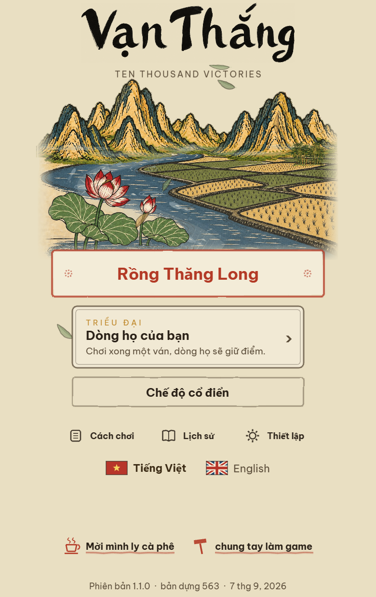
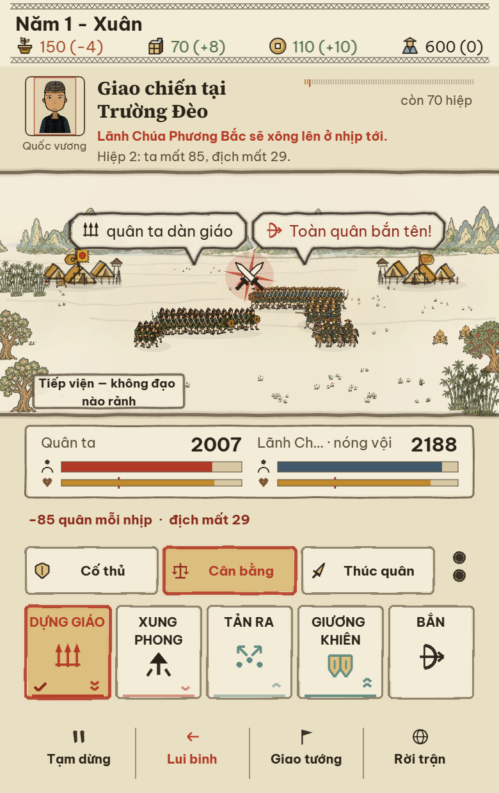
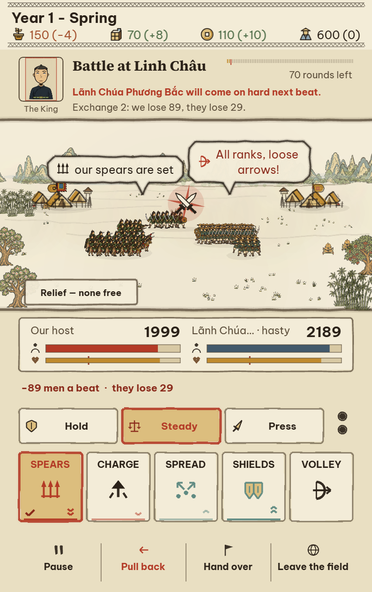
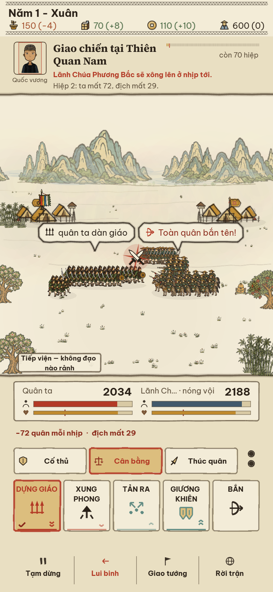

# Đông Hồ menu and battle interface

Completed 6 September 2026. Continues the [card-print family](dong-ho-card-prints.md) and [shared visual language](phase-1/30-dong-ho-visual-language.md).

## Menu

The menu retains its illustration, composition, animated layers, labels, button positions and navigation. A lighter shell-paper background now matches the card prints. The feathered illustration edges and lower veil use the same paper colour. Mountains and bamboo retain more of their existing pigment through slightly stronger layer opacity; the source images were not regenerated or recoloured. Secondary buttons use quiet paper rather than the previous yellow fill. Vermilion remains the primary action accent.

## Battle

- The backdrop pairs muted indigo distance with pale leaf-green hills. Camps use flat ochre cloth with strong ink contours, and authored plants retain more colour. Soldier artwork, army movement, battlefield geometry and simulation rules are preserved.
- Formation symbols now depict spearheads, a forward charge, outward dispersal, overlapping shields and a bow. Their maximum size increases from 15 to 23 design pixels, with measured fitting around wrapped labels and progress notes. The same symbols appear in army speech bubbles and the formation guide.
- Hold, Steady and Press have shield, balance and blade symbols alongside their existing translated labels.
- Selected commands use ochre paper and a vermilion outline. The current formation also has a checkmark. Unselected commands use light paper.
- Advantage and disadvantage have directional marks as well as colour: green/up and red/down. One mark means the softer matchup, two mean the stronger one. They answer the enemy's announced target. Hints remain hidden during the opening drum and on hard/nightmare difficulty.
- Troop and morale bars have person and heart labels on both sides. Flat fills replace the fuzzy layered strokes; vermilion identifies our strength, indigo theirs, and ochre morale. The rout threshold remains marked.
- Shared resource icons now use an ear of grain in a basket, a supply crate, a square-holed coin, and a person in a conical hat. They use warm-black contours and the same restrained pigments.
- Vietnamese and English coaching text explains the new selection, matchup and gauge symbols.

## Verification

All captures are local Chromium browser checks, not physical-phone performance measurements.

| Check | Result |
|---|---|
| Dedicated visual fit and state checks, Vietnamese/English at 390×620 and 390×844, DPR 2 | 25/25 |
| Battle press feedback, actual pointer order, transit bar, arrival, matchup outcomes, loss readouts and temporary battle decisions | 25/25 |
| Short-phone battle dock, touch targets, spacing and temporary battle decisions | 19/19 |
| Menu utility routes, language switching, retained illustration layers and short-phone layout | 17/17 |
| Formation/stance timing, stamina and enemy telegraph behaviour | 13/13 |
| Arena setup across both languages and heights; starting the configured fight | All 7 assertions pass |
| Production TypeScript, Vite and service worker build | Pass |
| Browser errors in the checks above | None |

The required web-game client was run and its menu screenshot/text state inspected. The dedicated capture also reaches real combat; its text states report `playing` and `lane:battle`. Screenshots were visually reviewed for icon recognition, label fitting, selection and matchup separation, and scenery contrast. [Detailed visual-check results](dong-ho-menu-battle/verification.json) and the remaining captures are in [the evidence directory](dong-ho-menu-battle).

The existing feedback test counted all Graphics objects to infer whether a transit bar appeared. A selection checkmark now leaves as that bar enters, so the count can remain constant. The test now verifies the active, visible, nonempty transit drawing belonging to the moving chip directly.

No new raster downloads or generated artwork were needed. Existing large-bundle and runtime-font stylesheet build warnings remain. Battle surfaces stay cached, and the four gauges reuse one Graphics object instead of creating new objects each beat.
