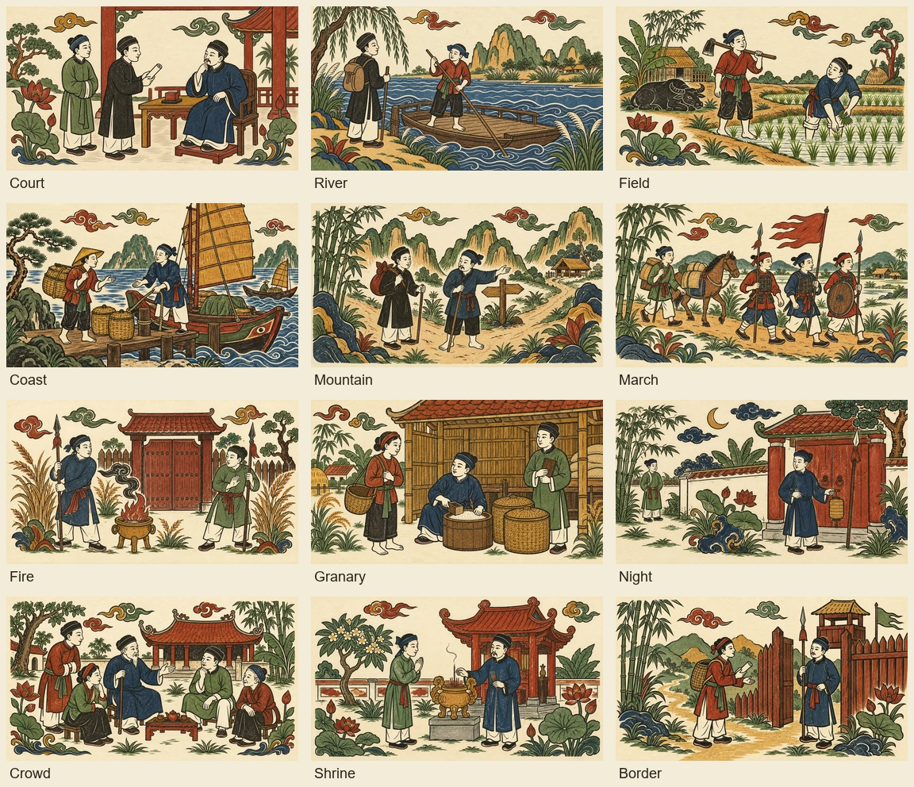

# Generated Đông Hồ story settings

Completed 8 September 2026. Story choices, outcome reports and Chronicle records now share generated artwork matching the existing power cards. The normal story path no longer draws procedural scenes.

## Coverage and selection

The catalogue contains 48 stories and 444 fragments. Previously, only 16 exact moments had a generated illustration; other moments used procedural bands or had no artwork. Twelve new landscape prints cover court, river, field, coast, mountain, march, danger/fire, granary, night, crowd, shrine and border settings. They are shared symbolic settings, not 444 separate event illustrations.

The renderer first selects an existing exact-moment print, then the current fragment's setting. Unbanded fragments use an authored override or a neutral template setting in `src/ui/storySettings.ts`. It never searches future fragments. An opening-only record gets the neutral setting; a held decision gets its known moment. The actual speaker retains the game's live portrait and name below the illustration.

Pictures keep their full source composition and aspect ratio. The header reserves up to 180 design units, with measured space below for the speaker and choices. No text is baked into the artwork. Existing story IDs, outcomes, costs, relationships and saved histories are unchanged.

If a specific moment image is missing, the generated setting is used. The local procedural band is used only when the setting image is also unavailable. This preserves usable choices when optional art cannot be downloaded or decoded.

## Artwork and provenance

- Built-in ImageGen generated each setting individually using the accepted `petition-v1.webp` and `harvest-v1.webp` as style references. No image-generation API/CLI fallback was used.
- [Exact prompts and reference paths](dong-ho-story-setting-prompts.json).
- [Generation log, original outputs, master paths and runtime hashes](dong-ho-story-setting-generation-log.json).
- Runtime files: `public/art/story-prints/setting-<setting>-v1.webp`; 768 × 432 each, 1,510,370 bytes total.
- Full PNG masters: `output/story-settings/masters/`.
- Export script: `scripts/conquest-art/export-story-setting.py <setting> <source.png>`. It only copies, contains, resizes and encodes; it does not redraw, crop or recolour artwork.
- Review board: `scripts/conquest-art/review-story-settings.py`.

The prints use warm black carved outlines, broad vermilion/ochre/leaf-green/indigo pigments, expressive simplified figures, flat symbolic space and pale shell paper. They are game illustrations rather than documentary reconstructions of named people or exact dynasty clothing. Fire and night scenes establish tension without asserting a destroyed city, death or betrayal.

The new settings load at the map scene boundary, not on the menu or in the History/Cabinet card catalogue. They add about 15.2 MiB of base RGBA texture data before renderer overhead. All twelve ship in `dist/` and belong to the service worker's optional art cache, with none added to the install-critical shell.

## Verification

- `DEV_URL=http://127.0.0.1:5183 node test_scripts/verify/verify-story-settings.mjs`: **80/80**. All 444 fragments actually create Image objects. All twelve settings are checked on Vietnamese 390 × 844, English 390 × 620 and Vietnamese 1440 × 900 layouts. Checks cover complete proportional fitting, clear speaker/options, actual text-state metadata, current/held/opening records and both fallback tiers.
- Real pointer sequence passes in all three layouts: scroll to a decision, refuse the marriage, verify the changed story memory and real outcome, acknowledge the report, open the Chronicle, and click the story row to see matching artwork in the recorded moment.
- `verify-dongho-card-prints.mjs`: **49/49**, including all 50 authored power images and all 16 selected story moments. Updated its old assumptions to wait for the game scene, accept the larger story header, hide both fallback tiers, and distinguish the 50 authored prints from the current 52-card catalogue.
- `verify-chronicle.mjs`: **15/15**; story graph, localization, live runs, memory and other-mode isolation remain valid.
- TypeScript and production build pass. Existing runtime-font and large-bundle warnings remain. All twelve new assets are present in the production optional-art list and absent from the critical list.
- The installed web-game skill client ran two bursts; its screenshot and text state were inspected. All twelve generated masters, the review board, representative phone/desktop prompts, reports, records, fallbacks and card bakes were visually reviewed. No browser errors in the final suites.

Evidence: `output/story-settings/verification/`, `output/story-settings/skill-client/` and `output/dongho-card-prints/verification/`. BrowserOS neo tools were unavailable; verification used the repository's local Playwright workflow. Test pointer coordinates include the desktop modal's world transform. Avoid editing repository files during a running browser harness: Vite reloads can invalidate its imported modules.

No required work remains. Future story templates should receive an explicit neutral entry in `STORY_SETTINGS`; the catalogue-wide test will identify missing coverage.
